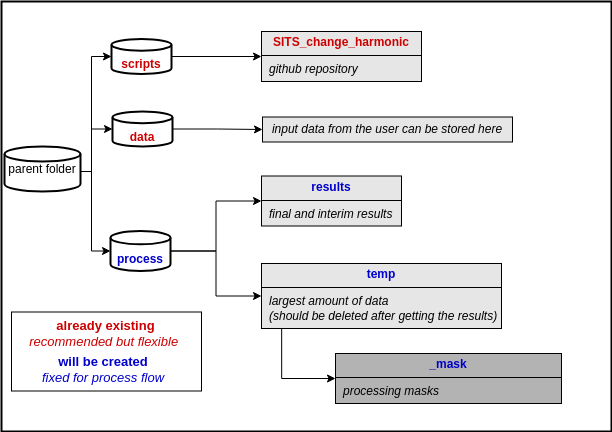

# SITS_change_harmonic

Harmonic Model for ChangeDetection based on FORCE Datacube

## 1. Installing
```
conda create --name SITSclass python==3.9
conda activate SITSclass
cd /path/to/repository/SITS_classification
pip install -r requirements.txt
sudo apt-get install xterm
```

_**Notes:**_

code is build upon FORCE-Datacube and -Framework (Docker, FORCE-Version 3.7.11)

[How to Install FORCE with Docker](https://force-eo.readthedocs.io/en/latest/setup/docker.html#docker)


## 2. Getting Started


### 2.1 Basics

This repository contains the code necessary to run Changedetection for Satellite Image Time Series with [Harmonic Model](https://www.sciencedirect.com/science/article/abs/pii/S0034425715000590) based on the [FORCE Datacube](https://force-eo.readthedocs.io/en/latest/index.html). 
It's based on the following folder structure:



Harmonic Model based on reference period will be used to predict expected spectral values. Those values will be compared with real spectral values regarding an uncertainty (standard deviation) and disturbance state can change with 3 consecutive times below or above threshold. 

Results can be plots for points:

 

And results can be grid based where every pixel has:
- the first date where the disturbance occurred
- 90th percentile for disturbance residuals over the entire time period
- 90th percentile for disturbance residuals within specified time ranges


### 2.2 Workflow

To execute the script simply set parameters in harmonic_main /harmonic_visualize and execute the file

There are entry points and use cases which are briefly shown in the following flow chart:


## Help/Known Issues

* None yet

# Info

## Authors

* [**Benjamin Stöckigt**](https://github.com/Bensouh)

## Version History

* 0.1
    * Initial Release

## License

GPL-3.0 license

## Acknowledgments

Inspiration, code snippets, etc.

* [FORDEAD](https://fordead.gitlab.io/fordead_package/)
* [FORCE Tutorials](https://force-eo.readthedocs.io/en/latest/howto/udf_py.html)
